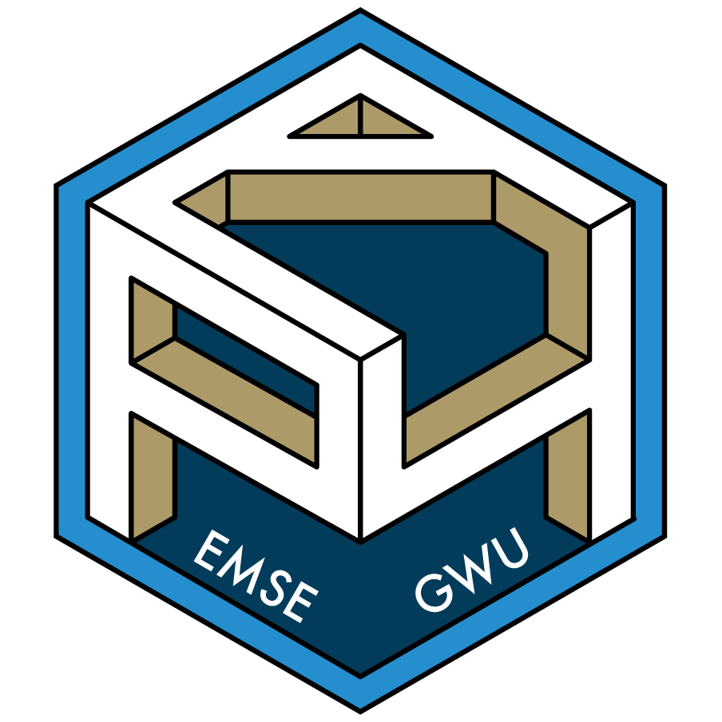
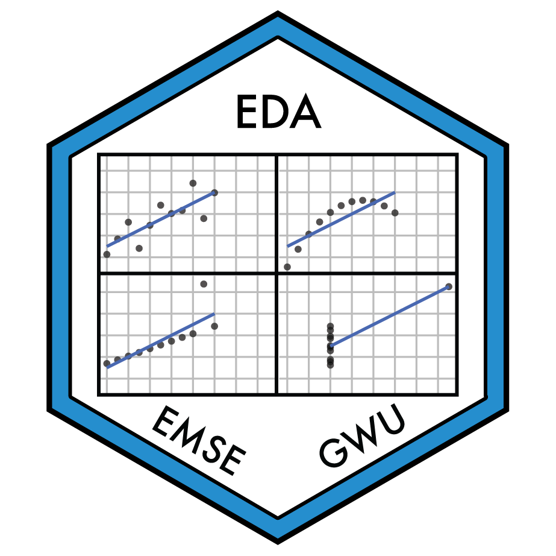
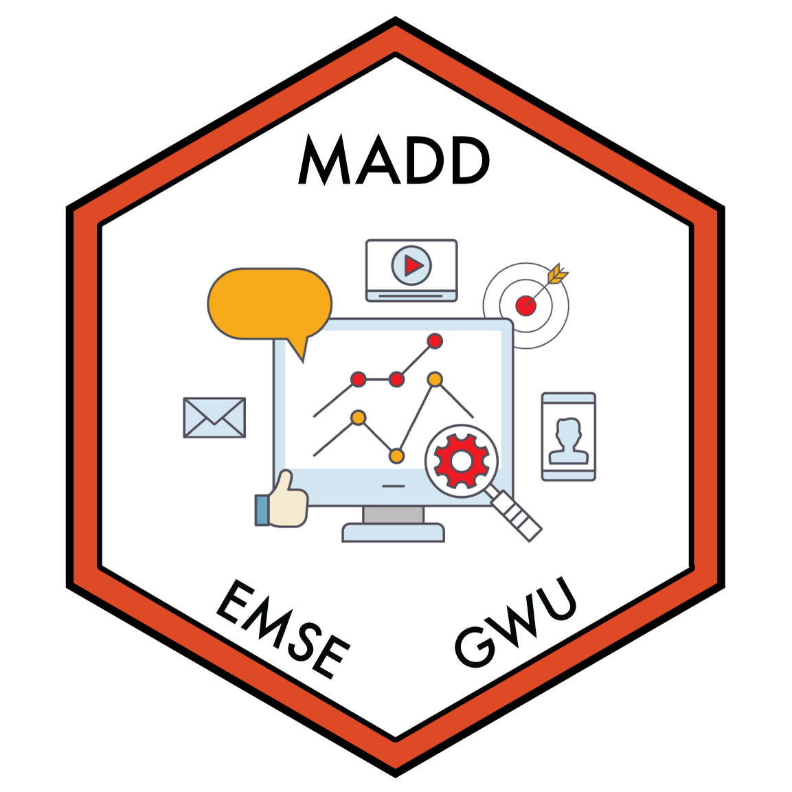

```{r setup}
source("_common.R")
```

::: {.course-card}

### [EMSE 4571: Programming for Analytics](https://p4a.seas.gwu.edu/)

::: {.course-logo}

:::

::: {.course-meta}
EMSE 4571 · Undergraduate
:::

An introductory course in programming with [R](https://www.r-project.org/), covering programming fundamentals (data types, functions, loops, testing, debugging), then data fundamentals (reading, wrangling, and visualizing real data sets). Assumes no prior programming experience.

[Course site](https://p4a.seas.gwu.edu/){.icon-link}

```{r, results='asis'}
cat(make_semesters("p4a"))
```

:::

::: {.course-card}

### [EMSE 4572: Exploratory Data Analysis](https://eda.seas.gwu.edu/)

::: {.course-logo}

:::

::: {.course-meta}
EMSE 4572 / 6572 · Undergraduate & Graduate
:::

Sourcing, wrangling, and visualizing data in [R](https://www.r-project.org/), grounded in the human psychology of visual information processing and fully reproducible workflows from raw data to results. Students design and carry out their own semester-long data projects.

[Course site](https://eda.seas.gwu.edu/){.icon-link}
[Project showcase](https://eda.seas.gwu.edu/showcase){.icon-link}

```{r, results='asis'}
cat(make_semesters("eda"))
```

:::

::: {.course-card}

### [EMSE 6035: Marketing of Technology](https://madd.seas.gwu.edu/)

::: {.course-logo}

:::

::: {.course-meta}
EMSE 6035 · Graduate
:::

Data-driven methods for making design decisions in competitive markets, covering consumer choice modeling, survey design, conjoint analysis, optimization, and market simulation in [R](https://www.r-project.org/). Teams assess the market competitiveness of an emerging technology in semester-long projects.

[Course site](https://madd.seas.gwu.edu/){.icon-link}
[Project showcase](https://madd.seas.gwu.edu/showcase){.icon-link}

```{r, results='asis'}
cat(make_semesters("madd"))
```

:::

::: {.course-card}

### [R for Analytics Primer](https://jhelvy.github.io/r4aPrimer/)

::: {.course-logo}

:::

::: {.course-meta}
Self-guided tutorial
:::

A self-guided tutorial for developing a foundation in programming in R for data analysis, including data input/output, data wrangling, and data visualization using the [Tidyverse](https://www.tidyverse.org/).

[Primer Website](https://jhelvy.github.io/r4aPrimer/){.icon-link}

:::

::: {.course-card .no-logo}

### [Workshops](https://jhelvy.com/workshops)

::: {.course-meta}
Conferences & universities
:::

Hands-on workshops on R, data visualization, reproducible research, and survey design.

[Browse all workshops](https://jhelvy.com/workshops){.icon-link}

:::
